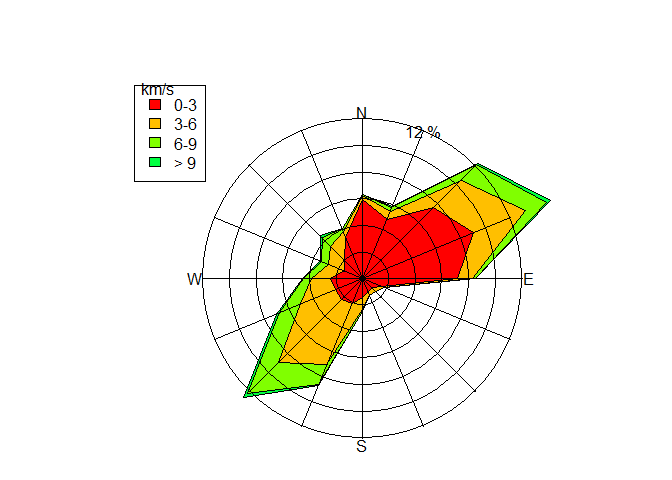

EJERCICOS DE LA LIBRERIA CLIMATOL
================
Velasquez_Fernandez_Benjy
31/1/2022

## NIVEL I

### 1.Generar un diagrama de Walter y Lieth con la data de datcli, este debe llevar de título “Estación Campo de Marte”, a una altitud de 80 msnm durante el año 2017, con los meses simbolizados por números. Las temperaturas deberán visualizarse de color verde; las precipitaciones, en naranja; los meses de congelación segura, en azul y los de congelación probable, en celeste. No trazar una línea suplementaria de precipitación.

install.packages(“climatol”)

``` r
library(climatol)
```

    ## Warning: package 'climatol' was built under R version 4.1.2

    ## Loading required package: maps

    ## Warning: package 'maps' was built under R version 4.1.2

    ## Loading required package: mapdata

    ## Warning: package 'mapdata' was built under R version 4.1.2

``` r
data(datcli)
diagwl(datcli,"Estacion Campo de Marte",80,"2017",mlab="es",pcol="blue",tcol="red",pfcol="brown",sfcol="purple",shem=F,ptline=T)
```

<!-- -->

### 2. Recrea minuciosamente el siguiente diagrama de la rosa de los vientos (pista: col=rainbow(8)).

``` r
data(windfr)
rosavent(windfr,fnum=6,fint=2, flab=1, ang=3*pi/8  ,col=rainbow(8), uni="km/s")
```

<!-- -->

## NIVEL II

### 3. Convertir la data diaria de tmax en una data de medias mensuales. Posteriormente, homogeneizar dichos datos mensuales con una normalización por estandarización y gráficos de medias anuales y correcciones aplicadas en el análisis exploratorio de datos (utilizar dos decimales).

``` r
data(tmax)
write.table(dat,"tmax_2001-2003.dat",row.names = F,col.names = F)
write.table(est.c,"tmax_2001-2003.est",row.names = F,col.names = F)
dd2m("tmax",2001,2003,ndec = 2,valm = 2)
```

    ##   1  2  3
    ## 
    ## Monthly mean values saved to file tmax-m_2001-2003.dat 
    ##   (Months with more than 10 missing original daily data
    ##   have also been set to missing)

``` r
tmax_m<-read.table("tmax-m_2001-2003.dat",header = F)
tmax_m
```

    ##      V1    V2    V3    V4    V5    V6    V7    V8    V9   V10   V11   V12
    ## 1 15.00 16.01 13.92 15.53 17.53 18.53    NA 16.92 20.47 20.86 24.28    NA
    ## 2 23.67 23.85    NA 27.34 26.89 32.26 32.75 32.59 30.65 29.78 29.83 28.36
    ## 3 25.81 22.23 21.85 20.87 21.42 20.00 19.93 16.50 17.56 13.45 14.04 16.24
    ## 4 15.71 14.76 15.38 11.66 16.29 19.85 17.87 19.90 20.20 18.88 23.25 25.83
    ## 5 26.96 27.48 28.25 30.25 30.03 30.93 30.88 32.39 32.37 28.81 27.76 27.34
    ## 6 22.75 23.21 19.76 19.45 18.30 16.71    NA 16.90 15.98 15.08 15.88    NA
    ## 7 16.41 15.65    NA 19.16 18.55 18.54 20.80 19.09 18.52 23.40 22.96 25.34
    ## 8 29.09 26.34 29.65 31.13 31.45 34.15 33.57 34.06 34.26 31.84 30.03 25.22
    ## 9 25.09 23.61 21.56 22.70 21.01 20.74 19.72 18.84 15.63 15.13 13.23 14.76

``` r
homogen("tmax",2001,2003,std=2,ndec=2,gp=3,expl=T)
```

    ## 
    ## HOMOGEN() APPLICATION OUTPUT  (From R's contributed package 'climatol' 3.1.1)
    ## 
    ## =========== Homogenization of tmax, 2001-2003. (Mon Jan 31 18:29:17 2022)
    ## 
    ## Parameters: varcli=tmax anyi=2001 anyf=2003 suf=NA nm=NA nref=10,10,4 std=2 swa=NA ndec=2 dz.max=5 dz.min=-5 wd=0,0,100 snht1=0 snht2=0 tol=0.02 maxdif=0.005 mxdif=0.005 maxite=999 force=FALSE wz=0.001 trf=0 mndat=NA gp=3 ini=NA na.strings=NA vmin=NA vmax=NA nclust=100 cutlev=NA grdcol=#666666 mapcol=#666666 hires=TRUE expl=TRUE metad=FALSE sufbrk=m tinc=NA tz=UTC cex=1.2 verb=TRUE
    ## 
    ## Data matrix: 1095 data x 3 stations

    ## Computing inter-station distances:  1  2
    ## 
    ## 
    ## ========== STAGE 3 (Final computation of all missing data) ==========
    ## 
    ## Computing inter-station weights... (done)

    ## Computation of missing data with outlier removal
    ## (Suggested data replacements are provisional)
    ## 
    ## The following lines will have one of these formats:
    ##   Station(rank) Date: Observed -> Suggested (Anomaly, in std. devs.)
    ##   Iteration Max.data.difference (Station_code)
    ## 2 0.0388 (S03)
    ## 3 -0.0044 (S01)
    ## 
    ## Last series readjustment (please, be patient...)

    ## 
    ## ======== End of the missing data filling process, after 2.44 secs 
    ## 
    ## ----------- Final computations:
    ## 
    ## ACmx: Station maximum absolute autocorrelations of anomalies
    ##    Min. 1st Qu.  Median    Mean 3rd Qu.    Max. 
    ##   0.490   0.510   0.530   0.520   0.535   0.540 
    ## 
    ## SNHT: Standard normal homogeneity test (on anomaly series)
    ##    Min. 1st Qu.  Median    Mean 3rd Qu.    Max. 
    ##   18.00   23.45   28.90   38.47   48.70   68.50 
    ## 
    ## RMSE: Root mean squared error of the estimated data
    ##    Min. 1st Qu.  Median    Mean 3rd Qu.    Max. 
    ##   3.664   3.672   3.680   3.716   3.742   3.804 
    ## 
    ## POD: Percentage of original data
    ##    Min. 1st Qu.  Median    Mean 3rd Qu.    Max. 
    ##   81.00   84.50   88.00   87.33   90.50   93.00 
    ## 
    ##   ACmx SNHT RMSE POD Code Name     
    ## 1 0.54 68.5 3.7  81  S01  La Vall  
    ## 2 0.53 28.9 3.7  88  S02  Lucent   
    ## 3 0.49 18.0 3.8  93  S03  Sunflower

    ## 
    ## ----------- Generated output files: -------------------------
    ## 
    ## tmax_2001-2003.txt :  This text output 
    ## tmax_2001-2003_out.csv :  List of corrected outliers 
    ## tmax_2001-2003_brk.csv :  List of corrected breaks 
    ## tmax_2001-2003.pdf :  Diagnostic graphics 
    ## tmax_2001-2003.rda :  Homogenization results. Postprocess with (examples):
    ##    dahstat('tmax',2001,2003) #get averages in file tmax_2001-2003-me.csv 
    ##    dahstat('tmax',2001,2003,stat='tnd') #get OLS trends and their p-values 
    ##    dahgrid('tmax',2001,2003,grid=YOURGRID) #get homogenized grids 
    ##    ... (See other options in the package documentation)

### 4. Recortar la data mensual de Ptest desde 1965 hasta 2005. Homogeneizar dicha data mediante clústers o áreas rectangulares, con un ancho de superposición de 0, mediante una estandarización y con gráficos de totales anuales en el análisis exploratorio de datos. Mostrar las medias de las series homogeneizadas en un archivo Excel que, además, mencione los totales anuales y los datos de la latitud, longitud y nombre de cada estación (utilizar dos decimales).

### 5. Con la data homogenizada del ejercicio anterior (si no se ha realizado, iniciar homogeneizando tal cual se menciona en el ejercicio 4) plotear un gráfico de calor con las medias de precipitación mensual de acuerdo con la latitud y longitud, este debe abarcar desde el punto 2.1°E 39.1°N hasta el punto 3.5°E 40°N, con una separación de 0.001 entre líneas. Además, debe tener un título principal y etiquetado en ambos ejes. Adicionalmente, plotear un mapa de la zona del mundo en cuestión encima de dicho gráfico (use col=rainbow(100)).
